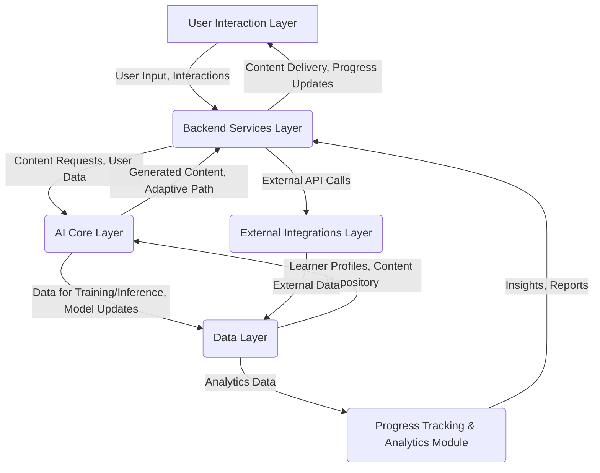

## AI Learning Engine Architecture and Algorithms Design

### 1. Overall Architecture of the AI Learning Engine

The AI Learning Engine will be designed as a modular, scalable, and highly interconnected system, enabling dynamic and hyper-personalized educational experiences. The architecture will follow a microservices-based approach to ensure flexibility, maintainability, and the ability to independently scale different components. At its core, the engine will leverage a combination of generative AI models, machine learning algorithms, and a robust data infrastructure to continuously adapt and optimize the learning journey for each user.

**High-Level Components:**

*   **User Interaction Layer (Frontend):** This layer will handle all user-facing interactions, including the learning interface, progress dashboards, and input mechanisms for user preferences and feedback. It will communicate with the Backend Services via APIs.
*   **Backend Services Layer:** This layer will comprise various microservices responsible for core functionalities such as user management, content delivery, learning path orchestration, and API gateways.
*   **AI Core Layer:** This is the brain of the platform, housing the specialized AI models for content generation, personalization, and adaptive feedback. It will interact with the Data Layer for training and inference.
*   **Data Layer:** This layer will store all relevant data, including user profiles, learning progress, content modules, performance metrics, and AI model parameters. It will be designed for high availability and efficient data retrieval.
*   **External Integrations Layer:** This layer will manage connections to third-party services, such as external content repositories, assessment tools, or specialized APIs (e.g., for real-time market data in the tech or business niches).

**Data Flow Overview:**

1.  **User Input:** Learners interact with the Frontend, providing initial preferences, skill levels, and learning goals. Their ongoing interactions (e.g., answers to questions, time spent on modules, project submissions) generate continuous data.
2.  **Data Ingestion & Processing:** All user interaction data, along with external content and market trends, is ingested into the Data Layer. Pre-processing and feature engineering occur here to prepare data for AI models.
3.  **Learner Profiling (AI Core):** AI models analyze user data to build and continuously update a comprehensive learner profile, including learning style, knowledge gaps, engagement patterns, and progress toward goals.
4.  **Content Generation & Curation (AI Core):** Based on the learner profile and the defined curriculum for a given niche, generative AI models create or adapt learning content (text, exercises, examples, case studies) in real-time. This includes fine-tuning existing content and generating new material as needed.
5.  **Adaptive Path Orchestration (Backend & AI Core):** Algorithms determine the optimal sequence of learning activities, dynamically adjusting the path based on the learner's performance, engagement, and updated profile. This involves selecting the most relevant AI-generated content and interactive elements.
6.  **Feedback & Assessment (AI Core):** AI models provide immediate, personalized feedback on learner responses, explain concepts, and generate adaptive assessments to gauge mastery and identify areas needing further attention.
7.  **Content Delivery (Backend):** The orchestrated learning path and generated content are delivered to the User Interaction Layer.
8.  **Performance Monitoring & Analytics (Data & Backend):** All learning activities and outcomes are tracked and analyzed to provide insights into learner progress, platform effectiveness, and areas for AI model improvement.

This modular design ensures that each component can be developed, tested, and scaled independently, allowing for rapid iteration and continuous improvement of the learning experience.

### 2. Components of the AI Learning Engine

#### 2.1. Learner Profiling Module

This module is responsible for creating, maintaining, and continuously updating a comprehensive digital profile for each learner. This profile is dynamic and evolves with every interaction, providing the AI with a nuanced understanding of the individual.

**Inputs:**
*   **Initial Assessment Data:** Results from diagnostic tests, pre-assessments, and self-reported skill levels.
*   **Demographic and Preference Data:** User-provided information on learning goals, preferred learning styles (e.g., visual, auditory, kinesthetic, reading/writing), time availability, and prior educational background.
*   **Interaction Data:** Granular logs of all user interactions with the platform, including:
    *   Time spent on modules/lessons.
    *   Answers to questions (correct/incorrect, type of error).
    *   Navigation patterns (e.g., skipping sections, re-visiting content).
    *   Engagement metrics (e.g., completion rates, activity levels).
    *   Feedback provided by the learner.
*   **Performance Data:** Scores on quizzes, assignments, projects, and simulated exams.

**Processing & Algorithms:**
*   **Knowledge Tracing:** Algorithms (e.g., Bayesian Knowledge Tracing, Deep Knowledge Tracing) will model the learner's mastery of individual concepts and skills over time, predicting their probability of answering a question correctly on a given topic.
*   **Learning Style Inference:** Machine learning models will infer and refine the learner's preferred learning style based on their interaction patterns and performance on different content formats. For example, a learner who excels with video content might be identified as a visual/auditory learner.
*   **Engagement Analysis:** Models will track engagement levels, identify signs of disengagement or frustration, and predict potential drop-off points. This includes analyzing response times, repeated errors, and navigation behavior.
*   **Goal Alignment:** The module will continuously assess the learner's progress against their stated goals, identifying discrepancies and suggesting adjustments to the learning path.
*   **Concept Graph Mapping:** Learner progress and knowledge gaps will be mapped onto a comprehensive concept graph for each niche, allowing for precise identification of prerequisite knowledge and related topics.

**Outputs:**
*   **Dynamic Learner Profile:** A continuously updated data structure containing inferred knowledge states, learning style, engagement status, and progress toward goals.
*   **Knowledge Gap Identification:** Specific concepts or skills where the learner demonstrates weakness or lack of understanding.
*   **Learning Style Recommendation:** Preferred content formats and instructional approaches for the individual.
*   **Engagement Signals:** Alerts or flags indicating potential disengagement or areas where intervention (e.g., a different type of content, a simpler explanation) might be needed.

#### 2.2. Content Generation & Curation Module

This module is at the heart of the hyper-personalization, responsible for creating and adapting learning materials on demand. It will leverage large language models (LLMs) and other generative AI techniques, guided by instructional design principles.

**Inputs:**
*   **Learner Profile:** Detailed information from the Learner Profiling Module (knowledge gaps, learning style, current engagement).
*   **Curriculum Structure:** Pre-defined learning objectives, key concepts, and skill hierarchies for each niche.
*   **Content Repository:** A vast library of foundational knowledge, examples, case studies, and raw data (e.g., coding exercises, financial statements, legal precedents) that the AI can draw upon and transform.
*   **Real-time Data Feeds:** For dynamic niches like tech and business, this includes live market data, news, and industry trends to ensure content relevance.

**Processing & Algorithms:**
*   **Generative AI (LLMs):** Fine-tuned LLMs will generate textual explanations, examples, analogies, summaries, and practice questions. They will be prompted to tailor the output to the learner's inferred learning style (e.g., more visual descriptions for visual learners, more step-by-step instructions for kinesthetic learners).
*   **Content Adaptation:** Algorithms will adapt existing content from the repository, rephrasing, simplifying, or elaborating based on the learner's current understanding and identified knowledge gaps. This includes generating alternative explanations if a concept is not grasped.
*   **Interactive Element Generation:** The module will create interactive quizzes, coding challenges, drag-and-drop exercises, and simulated scenarios dynamically. For instance, in tech, it could generate a unique bug for a learner to fix; in finance, a custom case study for analysis.
*   **Multi-modal Content Synthesis:** While primarily text-based initially, the system will be designed to integrate with future capabilities for generating diagrams, charts, or even simple audio explanations based on the textual content.
*   **Quality Assurance & Bias Mitigation:** Automated checks and human-in-the-loop processes will be implemented to ensure factual accuracy, pedagogical soundness, and to mitigate potential biases in AI-generated content.

**Outputs:**
*   **Personalized Learning Content:** Textual explanations, examples, case studies, and summaries tailored to the learner.
*   **Dynamic Exercises & Quizzes:** Interactive practice problems and assessments generated on demand.
*   **Analogies & Metaphors:** Custom-generated analogies to explain complex concepts in relatable terms.
*   **Summaries & Key Takeaways:** Concise summaries of learned material for review.

#### 2.3. Adaptive Feedback & Tutoring Module

This module provides real-time, intelligent feedback and acts as a virtual tutor, guiding the learner through challenges and reinforcing understanding.

**Inputs:**
*   **Learner Response:** The learner's answer to a question, solution to a problem, or interaction with an exercise.
*   **Learner Profile:** Current knowledge state and identified misconceptions from the Learner Profiling Module.
*   **Correct Answer/Solution:** The ground truth for the given problem.

**Processing & Algorithms:**
*   **Error Analysis:** AI models will analyze learner responses beyond just 

correct/incorrect, attempting to understand the underlying misconception or reasoning error.
*   **Contextual Feedback Generation:** Generative AI will craft personalized feedback messages that:
    *   Explain *why* an answer is incorrect, rather than just stating it.
    *   Provide hints or nudges to guide the learner toward the correct solution.
    *   Reference specific concepts or previous lessons if a knowledge gap is identified.
    *   Offer alternative explanations or analogies if the initial feedback is not effective.
*   **Proactive Tutoring:** Based on the learner profile and performance, the AI will proactively offer additional resources, practice problems, or re-explain concepts before the learner encounters significant difficulty.
*   **Sentiment Analysis:** (Future enhancement) Analyze learner sentiment from text inputs to detect frustration or confusion, allowing the AI to adjust its tone or approach.

**Outputs:**
*   **Personalized Feedback:** Explanations, hints, and corrective guidance.
*   **Targeted Remediation:** Suggestions for specific content or exercises to address identified knowledge gaps.
*   **Encouragement & Motivation:** Positive reinforcement and motivational messages.

#### 2.4. Learning Path Orchestration Module

This module acts as the conductor of the learning journey, dynamically sequencing content and activities to optimize learning outcomes.

**Inputs:**
*   **Learner Profile:** Current knowledge state, learning style, and goals.
*   **Curriculum Graph:** A structured representation of all concepts, skills, and their dependencies within a given niche.
*   **Content Availability:** Information on available AI-generated and pre-existing content modules.
*   **Learning Objectives:** The specific skills or knowledge the learner aims to acquire.

**Processing & Algorithms:**
*   **Dynamic Sequencing:** Reinforcement learning or adaptive control algorithms will determine the optimal next learning activity (e.g., a new concept, a practice problem, a review session) based on the learner's real-time performance and the curriculum graph. This moves beyond simple linear progression.
*   **Pacing Adjustment:** The module will adjust the pace of content delivery based on the learner's mastery and engagement, slowing down for difficult concepts and accelerating for mastered ones.
*   **Spaced Repetition Integration:** Algorithms will schedule review sessions for previously learned material at optimal intervals to enhance long-term retention.
*   **Diversification of Content Formats:** Based on the learner's inferred learning style, the module will prioritize delivering content in preferred formats (e.g., more interactive simulations for kinesthetic learners, more detailed text for reading/writing learners).
*   **Goal-Oriented Pathing:** The system will continuously evaluate the most efficient path to achieve the learner's stated goals, suggesting alternative routes or additional resources as needed.

**Outputs:**
*   **Personalized Learning Path:** A dynamic sequence of content modules, exercises, and assessments.
*   **Recommended Activities:** Suggestions for the next best step in the learning journey.
*   **Progress Tracking:** Updates on the learner's progress against their overall goals.

#### 2.5. Progress Tracking & Analytics Module

This module collects, processes, and visualizes all data related to learner progress and platform effectiveness.

**Inputs:**
*   **All Interaction Data:** Logs from the User Interaction Layer.
*   **Assessment Results:** Scores and performance data from quizzes and assignments.
*   **Learner Profile Updates:** Changes in knowledge state and skill mastery.

**Processing & Algorithms:**
*   **Data Aggregation:** Collects and aggregates data from all other modules.
*   **Performance Metrics Calculation:** Calculates key performance indicators (KPIs) such as completion rates, mastery levels, time-on-task, and engagement scores.
*   **Trend Analysis:** Identifies patterns and trends in individual and aggregate learner data to inform platform improvements and content optimization.
*   **Predictive Analytics:** (Future enhancement) Predicts potential learning difficulties or drop-off risks based on early warning signs.

**Outputs:**
*   **Learner Dashboards:** Visualizations of individual progress, strengths, and areas for improvement.
*   **Performance Reports:** Detailed reports for learners and (optionally) for administrators (in B2B scenarios).
*   **System Insights:** Data-driven insights for platform developers to refine AI models, improve content generation, and enhance user experience.

#### 2.6. External Integrations Module

This module handles secure and efficient communication with external services and data sources.

**Inputs:**
*   **Third-Party APIs:** Data from external content providers, market data feeds, or specialized tools.
*   **Authentication Credentials:** Secure credentials for accessing external services.

**Processing & Algorithms:**
*   **API Management:** Manages API calls, rate limiting, and error handling for external services.
*   **Data Transformation:** Converts data from external sources into a format compatible with the internal system.
*   **Security Protocols:** Ensures secure data exchange with third-party services.

**Outputs:**
*   **Integrated Data:** Seamless flow of external data into the Data Layer for AI processing.
*   **Service Connectivity:** Reliable connection to necessary third-party tools and content sources.

This detailed breakdown of the AI Learning Engine's components and their interactions forms the blueprint for developing a truly hyper-personalized and adaptive learning platform.

### 3. Algorithms for Personalized Content Generation

The personalized content generation process is a sophisticated interplay of various AI models, primarily focusing on Large Language Models (LLMs) and their ability to synthesize, adapt, and create new information based on specific parameters. The goal is to move beyond simple content retrieval to dynamic, on-the-fly creation that precisely matches the learner's needs.

**Core Principles:**
*   **Contextual Understanding:** The AI must deeply understand the learner's current knowledge state, misconceptions, learning style, and the specific concept being taught.
*   **Generative Capabilities:** Leveraging LLMs to produce coherent, accurate, and pedagogically sound content in various formats.
*   **Adaptivity:** Modifying content complexity, examples, and explanations based on real-time learner performance and feedback.
*   **Factual Accuracy & Safety:** Implementing robust mechanisms to ensure the generated content is factually correct and free from harmful biases.

**Key Algorithms and Techniques:**

#### 3.1. Learner-Aware Text Generation

This involves using LLMs to generate textual content (explanations, analogies, summaries, questions) that is specifically tailored to the individual learner.

*   **Prompt Engineering with Learner Profile:** The primary method will be to construct highly detailed prompts for the LLM that incorporate elements from the Learner Profile:
    *   **Knowledge State:** "Explain [Concept X] to a learner who understands [Prerequisite A] but struggles with [Related Concept B]."
    *   **Learning Style:** "Provide a visual analogy for [Concept Y] for a visual learner." or "Break down [Process Z] into step-by-step instructions for a kinesthetic learner."
    *   **Engagement Level:** "Re-explain [Concept W] in a more engaging way, perhaps using a real-world case study relevant to [Learner's Stated Interest]."
    *   **Language & Tone:** Adjusting the complexity of vocabulary and the formality of the tone based on the learner's proficiency and preferences.
*   **Retrieval-Augmented Generation (RAG):** To ensure factual accuracy and grounding in the curriculum, the LLM will not generate content purely from its internal knowledge. Instead, it will first retrieve relevant, verified information from a curated content repository (our knowledge base for each niche) and then use this retrieved information to inform its generation. This minimizes hallucinations and ensures consistency with the curriculum.
*   **Content Simplification/Elaboration:** Algorithms will analyze the complexity of generated text and, if needed, simplify it for struggling learners or elaborate on it for advanced learners, potentially by adding more technical details or deeper theoretical explanations.

#### 3.2. Dynamic Exercise and Assessment Generation

Beyond static questions, the AI will generate interactive exercises and assessments that adapt to the learner's progress.

*   **Problem Space Definition:** For each concept, a defined problem space will exist, outlining the types of questions, variables, and constraints that can be used to generate unique problems.
*   **Parameter Randomization:** For quantitative problems (e.g., coding challenges, financial calculations), parameters (numbers, variable names, scenarios) will be randomized to create an endless supply of unique practice problems.
*   **Distractor Generation (for MCQs):** For multiple-choice questions, the AI will generate plausible but incorrect distractors based on common misconceptions identified through error analysis from other learners or pre-defined error patterns.
*   **Scenario-Based Question Generation:** For qualitative subjects (e.g., business strategy, legal compliance), the AI will generate unique case studies or scenarios that require the application of learned principles.
*   **Adaptive Difficulty Adjustment:** Based on the learner's performance on previous questions, the system will dynamically adjust the difficulty of subsequent questions, ensuring optimal challenge without overwhelming the learner.

#### 3.3. Multi-Modal Content Integration (Future)

While initial focus will be on text, the architecture will support future integration of other modalities.

*   **Diagram/Chart Generation:** Algorithms to convert textual data or concepts into visual representations (e.g., flowcharts for processes, graphs for data trends) based on learner preference.
*   **Audio Explanations:** Text-to-speech synthesis of AI-generated explanations, potentially with different voices or tones.
*   **Interactive Simulations:** For complex topics, generating mini-simulations or interactive models that allow learners to experiment with concepts.

#### 3.4. Quality Control and Iteration

Ensuring the quality and accuracy of AI-generated content is paramount.

*   **Automated Evaluation Metrics:** Implementing metrics to assess the coherence, relevance, and factual accuracy of generated content. This could involve cross-referencing with trusted sources or using other AI models for evaluation.
*   **Human-in-the-Loop (HITL):** Initially, human experts will review a significant portion of AI-generated content, providing feedback that is then used to fine-tune the generative models. This will be crucial for high-stakes content (e.g., professional certifications).
*   **Learner Feedback Loop:** Direct feedback from learners on the quality and helpfulness of generated content will be collected and used to continuously improve the models.
*   **A/B Testing:** Experimenting with different content generation strategies and evaluating their impact on learning outcomes.

By combining these algorithmic approaches, the platform will deliver a truly dynamic and personalized content experience, moving beyond static libraries to a continuously evolving, learner-centric curriculum.

### 4. Algorithms for Adaptive Learning Paths

The adaptive learning path algorithms are responsible for orchestrating the learner's journey through the curriculum, ensuring that the sequence of content and activities is optimized for individual progress and mastery. This goes beyond simple branching and aims for a truly dynamic, responsive learning experience.

**Core Principles:**
*   **Optimal Challenge:** Presenting content that is neither too easy (leading to boredom) nor too difficult (leading to frustration), maintaining the learner within their Zone of Proximal Development.
*   **Mastery-Based Progression:** Ensuring that learners achieve a certain level of mastery on prerequisite concepts before moving to more advanced topics.
*   **Efficiency:** Guiding learners through the most effective path to achieve their learning goals, minimizing wasted time on already mastered concepts.
*   **Retention:** Incorporating strategies to enhance long-term memory retention, such as spaced repetition.

**Key Algorithms and Techniques:**

#### 4.1. Reinforcement Learning for Path Optimization

Reinforcement Learning (RL) is a powerful paradigm for sequential decision-making, making it highly suitable for optimizing learning paths. The system (agent) learns to choose actions (e.g., present a new concept, offer a practice problem, suggest a review) that maximize a reward signal (e.g., learner mastery, engagement, completion rate).

*   **Agent:** The AI learning engine.
*   **Environment:** The learner and the curriculum.
*   **State:** The learner's current profile (knowledge state, learning style, engagement, progress).
*   **Actions:** The next learning activity to present (e.g., `present_concept(X)`, `generate_practice_problem(Y)`, `recommend_review(Z)`).
*   **Reward:** A composite score based on:
    *   **Mastery Gain:** Increase in knowledge state for relevant concepts.
    *   **Engagement:** Time spent, completion of activities, positive feedback.
    *   **Efficiency:** Progress towards goals with minimal unnecessary steps.
    *   **Retention:** Performance on spaced repetition quizzes.

*   **RL Algorithms:** Algorithms like Q-learning or Deep Q-Networks (DQN) can be used. The RL agent would learn a policy that maps learner states to optimal actions. For instance, if a learner masters a concept quickly, the RL agent might decide to skip some introductory material and move to more advanced applications.

#### 4.2. Knowledge Graph Traversal and Dependency Management

The curriculum for each niche will be represented as a comprehensive knowledge graph, where nodes are concepts/skills and edges represent dependencies (e.g., `Concept A` is a prerequisite for `Concept B`).

*   **Prerequisite Checking:** Before presenting a new concept, the algorithm will check the learner's knowledge state (from the Learner Profiling Module) against the prerequisites defined in the knowledge graph. If prerequisites are not met, the path will dynamically shift to cover those first.
*   **Adaptive Sequencing:** The system will use graph traversal algorithms (e.g., topological sort, shortest path algorithms) to identify the most logical and efficient sequence of concepts for a given learner, considering their current knowledge and target goals.
*   **Interleaving & Spacing:** The algorithms will strategically interleave different topics and space out repetitions of concepts to improve long-term retention, based on cognitive science principles.

#### 4.3. Dynamic Pacing and Difficulty Adjustment

The learning path will continuously adjust its pace and the difficulty of content based on the learner's real-time performance.

*   **Performance-Based Pacing:** If a learner is struggling with a concept, the system will slow down, providing more examples, additional practice, or alternative explanations. If a learner is excelling, the pace will accelerate, potentially skipping redundant material.
*   **Item Response Theory (IRT) Integration:** IRT models can be used to estimate a learner's ability level and the difficulty of questions, allowing the system to select questions that are optimally challenging for the learner, thereby maximizing the information gained from each interaction.
*   **Error-Driven Remediation:** When errors occur, the adaptive path will trigger targeted remediation, directing the learner to specific sub-concepts or foundational knowledge identified as weak points by the Learner Profiling Module.

#### 4.4. Goal-Oriented Path Generation

The learning path will be explicitly aligned with the learner's stated goals, whether it's passing a certification exam, mastering a specific programming language, or building a personal brand.

*   **Goal Decomposition:** Complex goals will be decomposed into smaller, measurable sub-goals and mapped to specific nodes in the knowledge graph.
*   **Progress Visualization:** The learning path will provide clear visual indicators of progress towards these goals, motivating the learner and allowing them to track their journey.
*   **Path Re-optimization:** If a learner's goals change, or if their progress deviates significantly from the optimal path, the system will re-optimize the learning sequence to realign with the updated objectives.

By combining these adaptive algorithms, the AI Learning Engine will create a truly personalized and responsive learning journey, maximizing engagement, accelerating mastery, and ensuring that learners achieve their specific educational and career objectives.

### 5. Data Flow and Interaction Between Components

The seamless flow of data and well-defined interactions between the various modules are critical for the AI Learning Engine to function as a cohesive, adaptive system. This section outlines the primary data exchanges and communication protocols.

#### 5.1. Data Flow Diagram (Conceptual)

#### 5.2. Component Interaction Details

**1. User Interaction Layer (Frontend) <-> Backend Services Layer:**
*   **Request:** The Frontend sends requests to the Backend for:
    *   User authentication and authorization.
    *   Initial learner profile setup.
    *   Retrieval of learning content (lessons, exercises, assessments).
    *   Submission of learner responses (answers, project files).
    *   Updates to user preferences or goals.
    *   Access to progress dashboards and reports.
*   **Response:** The Backend responds with:
    *   Authenticated user sessions.
    *   Personalized learning content (text, interactive elements).
    *   Feedback on submitted responses.
    *   Updated progress data.
    *   Error messages or status updates.
*   **Protocol:** RESTful APIs will be primarily used for communication, ensuring statelessness and scalability.

**2. Backend Services Layer <-> AI Core Layer:**
*   **Request:** The Backend sends requests to the AI Core for:
    *   Learner profile updates (e.g., after a new interaction).
    *   Content generation requests (e.g., generate an explanation for a specific concept for a specific learner).
    *   Adaptive path recommendations (e.g., what is the next optimal learning activity).
    *   Feedback generation for learner responses.
    *   Knowledge tracing updates.
*   **Response:** The AI Core responds with:
    *   Updated learner profiles.
    *   Generated learning content.
    *   Recommended next steps in the learning path.
    *   Personalized feedback messages.
    *   Inferred knowledge states.
*   **Protocol:** Internal APIs (e.g., gRPC for high-performance, low-latency communication) will be used to facilitate efficient data exchange between microservices within the Backend and AI Core. Asynchronous messaging queues (e.g., Kafka, RabbitMQ) will be employed for tasks like content generation that might be computationally intensive and don't require immediate synchronous responses.

**3. AI Core Layer <-> Data Layer:**
*   **Read Operations:** The AI Core reads from the Data Layer for:
    *   Retrieving current learner profiles.
    *   Accessing the curated content repository (knowledge base).
    *   Fetching historical performance data for model training and inference.
    *   Retrieving curriculum knowledge graphs.
*   **Write Operations:** The AI Core writes to the Data Layer for:
    *   Storing updated learner profiles.
    *   Logging AI model inference results and confidence scores.
    *   Storing newly generated content (if deemed reusable or for caching).
*   **Protocol:** Direct database connections or ORM (Object-Relational Mapping) will be used for efficient data access. Data will be stored in a combination of relational databases (for structured user data, progress) and NoSQL databases (for flexible content storage, large-scale interaction logs).

**4. Data Layer <-> External Integrations Layer:**
*   **Read Operations:** The Data Layer receives data from External Integrations for:
    *   Ingesting real-time market data.
    *   Importing external content or resources.
*   **Write Operations:** The Data Layer sends data to External Integrations for:
    *   Exporting analytics data to external reporting tools (if applicable).
*   **Protocol:** APIs, webhooks, and potentially data streaming services will be used for robust and scalable data ingestion and export.

**5. Data Layer <-> Progress Tracking & Analytics Module:**
*   **Read Operations:** The Progress Tracking & Analytics Module reads all relevant data from the Data Layer to perform analysis.
*   **Write Operations:** The module writes aggregated metrics, trends, and insights back to the Data Layer for storage and retrieval by the Backend Services (for dashboards).
*   **Protocol:** Direct database access or specialized analytics queries will be used.

**6. Backend Services Layer <-> External Integrations Layer:**
*   **Request:** The Backend initiates calls to external APIs via the External Integrations Layer for specific functionalities (e.g., payment gateways, email services, specialized third-party assessment tools).
*   **Response:** External Integrations return results from these API calls.
*   **Protocol:** RESTful APIs.

This intricate data flow ensures that all components are continuously informed by the latest learner data and content, enabling the AI to provide a truly adaptive and personalized learning experience.

